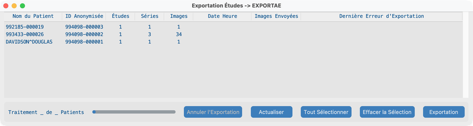
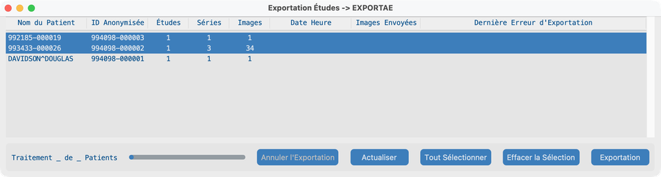
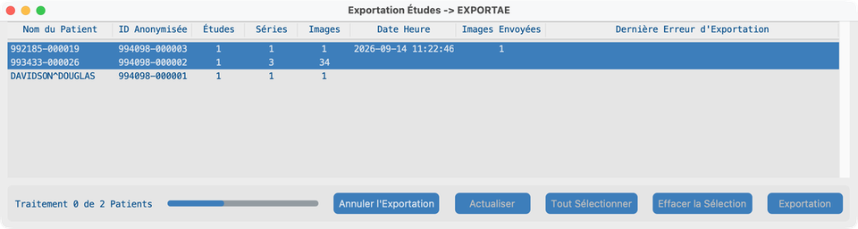
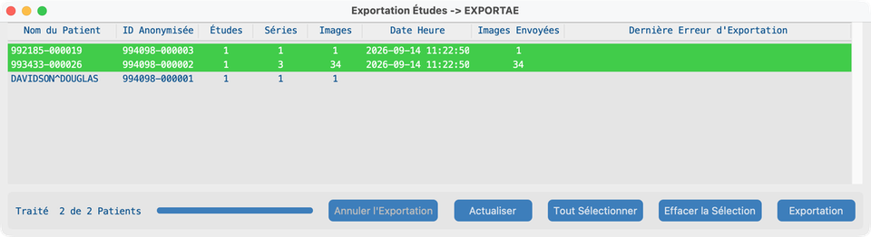

# Envoyer

## Objectif

Envoyer des patients anonymisés vers un système DICOM distant ou AWS S3. Surveillez le statut jusqu’à ce que les lignes apparaissent comme envoyées.

## Avant de commencer

1. Configurez le **Serveur d'exportation** (ou AWS Cognito pour S3) dans [Paramètres du projet](../05-create-project/).
2. Importez au moins une étude pour que la liste Envoyer ne soit pas vide ([Rechercher](../06-search/) ou Jeu de données).

## Flux de travail

### 1. Vue Envoyer initiale

1. Depuis le Tableau de bord, cliquez sur **Envoyer**.
2. La fenêtre d’exportation liste les patients anonymisés (un patient peut inclure plusieurs études).
3. Confirmez que le titre montre votre destination (AE title d’export ou projet AWS).

### 2. Sélectionner des patients

1. Cliquez sur une ou plusieurs lignes patient (SHIFT / CMD ou CTRL pour multi-sélection), ou cliquez sur **Tout Sélectionner**.
2. Utilisez **Effacer la Sélection** si vous devez recommencer.
3. Les lignes déjà envoyées (vertes) sont en général laissées de côté ; l’application ne renvoie pas les objets terminés par défaut.

### 3. Envoi en cours

1. Cliquez sur **Exportation**.
2. Pour les destinations DICOM, l’application fait d’abord un écho vers le serveur d’exportation ; corrigez les erreurs de connexion avec l’informatique si l’écho échoue.
3. Pendant l’export, les boutons d’action se désactivent, **Annuler l'Exportation** s’active, et la ligne de statut montre la progression (par exemple Processing 0 of N Patients).
4. **Date Heure** et **Images Envoyées** se mettent à jour à mesure que chaque patient se termine.

### 4. Envoyé

1. Lorsque tous les patients sélectionnés sont terminés, le statut montre **Processed N of N Patients**.
2. Les lignes réussies passent au **vert** avec **Date Heure** et **Images Envoyées** renseignés.
3. Les patients que vous n’avez pas sélectionnés restent inchangés.
4. Les lignes en échec passent au **rouge** et montrent **Dernière Erreur d'Exportation** ; sélectionnez-les et exportez à nouveau si besoin.

## Ce qui indique que tout va bien

- Les patients sélectionnés se terminent avec des lignes vertes et des compteurs **Images Envoyées** cohérents.
- Le PACS ou le bucket S3 de destination montre les études anonymisées.

## En cas d’échec

- Échec d’écho / d’authentification → vérifiez le serveur d’exportation ou les identifiants AWS Cognito avec l’informatique.
- Rien de sélectionné → sélectionnez d’abord des patients.
- Échecs partiels → lisez **Dernière Erreur d'Exportation**, corrigez la destination, resélectionnez les lignes rouges, Exportation à nouveau.

## Prochaines étapes

Optionnel : [Exécution sans interface](../10-headless/) pour la réception laboratoire/serveur ou un lot de nuit.
