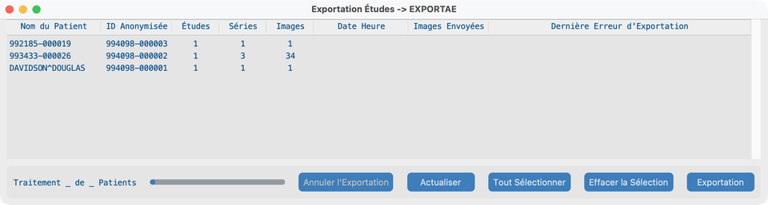
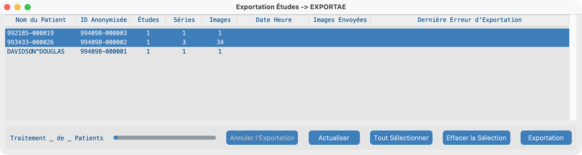
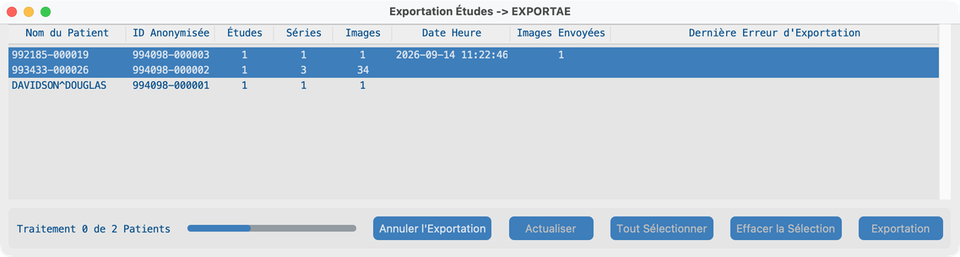
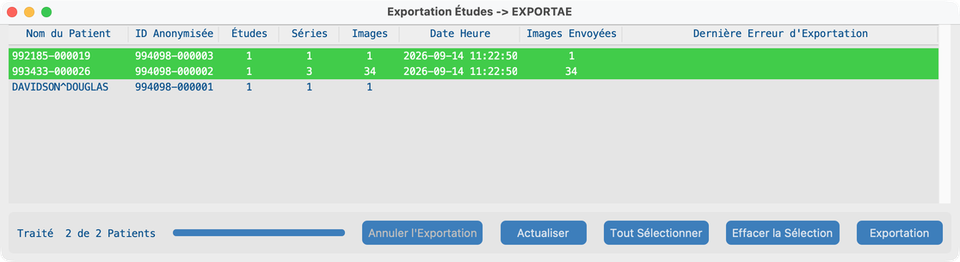

# Envoyer

## Objectif

Envoyer des patients anonymisés vers un système DICOM distant ou AWS S3. Surveillez le statut jusqu’à ce que les lignes apparaissent comme envoyées.

## Avant de commencer

1. Configurez le **Serveur d'exportation** (ou AWS Cognito pour S3) dans [Paramètres du projet](../05-create-project/).
2. Importez au moins une étude pour que la liste Envoyer ne soit pas vide ([Rechercher](../06-search/) ou Jeu de données).

## Flux de travail

### 1. Vue Envoyer initiale

1. Depuis le Tableau de bord, cliquez sur **Envoyer**.
2. La fenêtre d’exportation liste les patients anonymisés (un patient peut inclure plusieurs études).
3. Confirmez que le titre montre votre destination (AE title d’export ou projet AWS).

### 2. Sélectionner des patients

1. Cliquez sur une ou plusieurs lignes patient (SHIFT / CMD ou CTRL pour multi-sélection), ou cliquez sur **Tout Sélectionner**.
2. Utilisez **Effacer la Sélection** si vous devez recommencer.
3. Les lignes déjà envoyées (vertes) sont en général laissées de côté ; l’application ne renvoie pas les objets terminés par défaut.

### 3. Envoi en cours

1. Cochez éventuellement **Exporter les segments en DICOM-SEG** (voir [ci-dessous](#exporter-les-segments-en-dicom-seg)).
2. Cliquez sur **Exportation**.
3. Pour les destinations DICOM, l’application fait d’abord un écho vers le serveur d’exportation ; corrigez les erreurs de connexion avec l’informatique si l’écho échoue.
4. Pendant l’export, les boutons d’action se désactivent, **Annuler l'Exportation** s’active, et la ligne de statut montre la progression (par exemple Processing 0 of N Patients).
5. **Date Heure** et **Images Envoyées** se mettent à jour à mesure que chaque patient se termine.

### 4. Envoyé

1. Lorsque tous les patients sélectionnés sont terminés, le statut montre **Processed N of N Patients**.
2. Les lignes réussies passent au **vert** avec **Date Heure** et **Images Envoyées** renseignés.
3. Les patients que vous n’avez pas sélectionnés restent inchangés.
4. Les lignes en échec passent au **rouge** et montrent **Dernière Erreur d'Exportation** ; sélectionnez-les et exportez à nouveau si besoin.

## Exporter les segments en DICOM-SEG

Lorsque **Exporter les segments en DICOM-SEG** est coché dans la fenêtre Envoyer, l’application convertit les segments sur disque en objets DICOM Segmentation et les envoie avec les images anonymisées (serveur DICOM ou AWS S3).

### Contenu inclus

Pour chaque série qui a des données de segments :

- Masques d’anatomie **TotalSegmentator** du cache de série (`0_TS_SEG/seg/`), par exemple cerveau et structures cérébrales après Harmoniser / Brain Structures
- **Annotations ROI utilisateur** de la vue série (`0_TS_SEG/annotations/`)

Les masques Face Blur ne sont **pas** exportés en DICOM-SEG.

### Combien de fichiers DICOM

- **Un fichier DICOM-SEG par série source** (pas un fichier par organe ou label).
- En local il est écrit à côté des images de cette série sous `roi_annotations.seg.dcm` avant l’envoi.
- Ce seul fichier contient **tous** les segments de la série (structures TS et ROI utilisateur) comme entrées de la `SegmentSequence` DICOM, avec des frames binaires par segment sur les coupes qui ont des voxels.

### Format SEG utilisé

Les objets exportés suivent l’IOD DICOM **Segmentation Storage** (classe SOP `1.2.840.10008.5.1.4.1.1.66.4`), modalité **SEG** :

| Attribut | Valeur utilisée |
| --- | --- |
| `SegmentationType` | `BINARY` |
| `BitsAllocated` / `BitsStored` | `1` (frames bit-packés ; autorisé par DICOM pour BINARY) |
| `ImageType` | `DERIVED\PRIMARY` |
| Syntaxe de transfert | Explicit VR Little Endian |
| Types d’algorithme | `AUTOMATIC` pour les masques TotalSegmentator ; `MANUAL` pour les ROI utilisateur (mélange dans un fichier autorisé) |

Également inclus pour le lien visionneuse :

- `ReferencedSeriesSequence` de niveau supérieur (série source + UID d’instances)
- `DimensionOrganizationSequence` / `DimensionIndexSequence` multi-frames
- Par frame : position/orientation du plan et références de dérivation vers les coupes source

**Visualisation :** Orthanc et de nombreux PACS **stockent** le SEG comme série sœur sous la même étude. L’explorateur Orthanc intégré et des visionneuses comme Horos **n’affichent** souvent pas le SEG en superposition sur CT/MR même si l’objet est valide. Pour vérifier les superpositions, ouvrez l’**étude entière** (images + SEG) dans un outil compatible SEG tel que **3D Slicer**, MITK ou OHIF — pas le fichier SEG seul.

### Apparence sur le serveur DICOM

| | Images CT / MR source | DICOM-SEG |
| --- | --- | --- |
| Étude | Étude anonymisée | **Même étude** (`StudyInstanceUID`) |
| Série | Série d’images d’origine | **Série distincte** (nouveau `SeriesInstanceUID`, numéro de série `9001`) |
| Description de série | Originale (ex. Routine Brain) | `Anatomy Segments`, `ROI Annotations` ou `Segments + ROI Annotations` |
| Instances | Nombreuses instances d’image | **Une** instance SEG pour cette série |

L’objet SEG n’est **pas** stocké dans la série d’images source. Dans l’archive il apparaît comme une **série SEG sœur sous la même étude**.

Si une série n’a ni masques TS ni annotations utilisateur, aucun fichier SEG n’est créé pour cette série.

### Colonnes de la vue Exportation

La liste des patients inclut :

- **Images** — nombre d’instances anonymisées (exclut les `roi_annotations.seg.dcm` préparés)
- **Segments** — total des **labels** de segment exportables pour le patient (masques TS + ROI utilisateur ; Face Blur exclu)
- **Images Envoyées** — fichiers envoyés avec succès. Avec **Exporter les segments en DICOM-SEG**, chaque série segmentée ajoute **une** instance SEG (tous les labels de la série dans un seul DICOM-SEG), ≈ `Images + (séries segmentées)`

## Ce qui indique que tout va bien

- Les patients sélectionnés se terminent avec des lignes vertes et des compteurs **Images Envoyées** cohérents.
- Le PACS ou le bucket S3 de destination montre les études anonymisées.
- Avec **Exporter les segments en DICOM-SEG** coché, chaque série segmentée a aussi une série **SEG** sœur à la destination (même étude, série distincte).

## En cas d’échec

- Échec d’écho / d’authentification → vérifiez le serveur d’exportation ou les identifiants AWS Cognito avec l’informatique.
- Rien de sélectionné → sélectionnez d’abord des patients.
- Échecs partiels → lisez **Dernière Erreur d'Exportation**, corrigez la destination, resélectionnez les lignes rouges, Exportation à nouveau.

## Prochaines étapes

Optionnel : [Exécution sans interface](../10-headless/) pour la réception laboratoire/serveur ou un lot de nuit.
