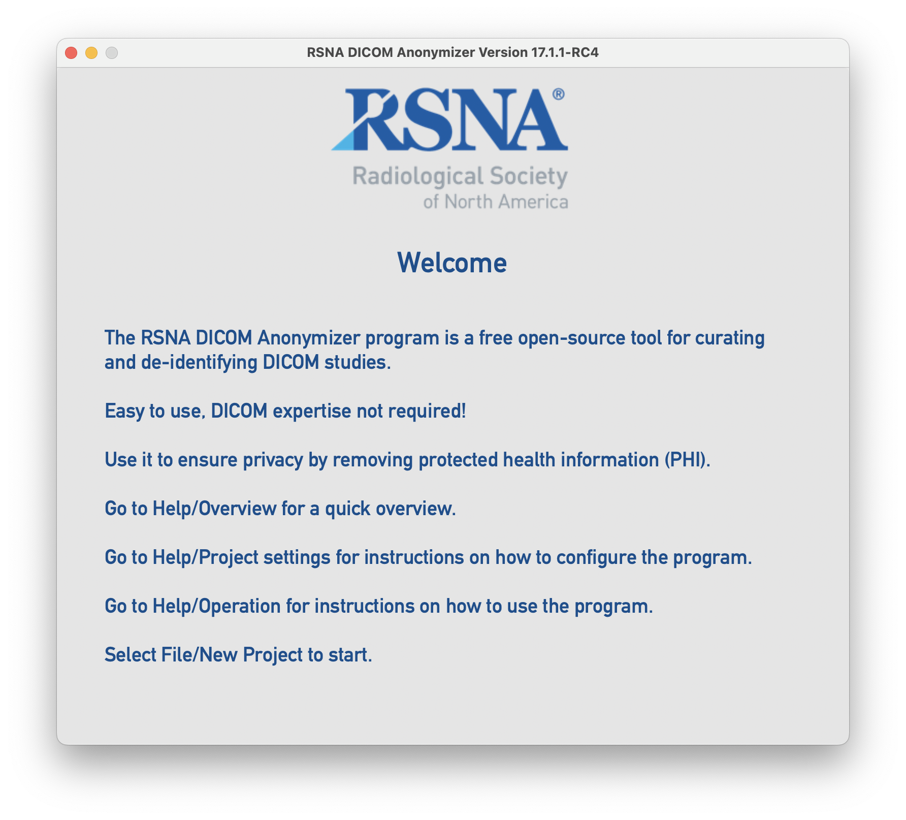

# RSNA DICOM Anonymizer V17

## Installation 
Select the correct binary download for your platform from the available [releases](https://github.com/mdevans/anonymizer/releases)
### 1. Windows
Download and extract zip to desired application directory.
Execute Anonymizer.exe and override User Account Control to allow the program to "Run anyway".
### 2. Mac OSX
Download and extract zip file to desired application directory.
Open a Terminal at the dist sub-directory and run the following commmand to remove the extended atrributes from the application: 
```
xattr -r -c Anonymizer_17.*.*.app 
```
Double click the application icon to execute.
### 3. Ubuntu

## Documentation
[Help files](https://mdevans.github.io/anonymizer/index.html)
## Development
### Setup
1. Setup python enviroment (>3.10), recommend using pyenv
2. ```pip install pipenv```
3. Clone repository
4. Setup virtual enviroment and install all  dependencies listed in Pipfile: ```pipenv install --dev```
### Architecture
