# RSNA DICOM Anonymizer V17
[](readme.de.md)
[](readme.es.md)
[](readme.fr.md)
[](https://github.com/mdevans/anonymizer/actions/workflows/build.yml)


## Installation 
Select the correct binary download for your platform from the available [releases](https://github.com/rsna/anonymizer/releases)
### Windows
1. Download and extract zip to desired application directory.
2. Execute Anonymizer.exe and override User Account Control to allow the program to "Run anyway".
3. Logs will be written to `~/AppData/Local/Anonymizer`
### Mac OSX
1. Download and extract zip file to desired application directory.
2. Mount the disk by clicking the `Anonymizer_17.*.dmg` file where * is the relevant version.
3. In the finder window presented, drag the Anonymzier icon to Applications folder.
4. Wait for the Application to be decompressed and copied.
5. Open a terminal (`/Applications/Utilities/Terminal`) 
6. To remove extended attributes, in the terminal, execute the command: `xattr -rc /Applications/Anonymizer_17.*.app`.
7. Double click the application icon to execute.
8. Logs will be written to `~/Library/Logs/Anonymizer/anonymizer.log`
### Linux
1. Download and extract zip file to desired application directory.
2. Open terminal cd to application directory
3. `chmod +x Anonymizer_17.*` where * is the relevant version
4. Execute `./Anonymizer_17.*` 
5. Logs will be written to `~/Logs/Anonymizer/anonymizer.log`
## Documentation
[Help files](https://rsna.github.io/anonymizer)
## Development
### Setup
1. Setup python enviroment (>3.10), recommend using pyenv
2. `pip install pipenv`
3. Clone repository
4. Setup virtual enviroment and install all  dependencies listed in Pipfile: `pipenv install --dev`
### Unit Testing 
#### For model and controller with coverage
```
1. Create tests/controller/.env file with your AWS_USERNAME and AWS_PASSWORD
2. pipenv shell
3. coverage run -m pytest tests
4. coverage report --omit="tests/*"
```
### Build executables
1. If building on OSX ensure create-dmg is installed: `brew install create-dmg`
2. `pipenv shell` 
3. `cd src`
4. `python build.py`
5. Executable will be in `src/dist` 
### Github Actions CI/CD
1. See: `.github/workflows/build.yml`
2. Triggered by push and pull request on master branch
3. Includes executable build step using `build.py`
### Code Metrics 
#### Using radon
```
1. pipenv shell
2. radon raw -i "tests,docs,prototyping" . > radon_results.txt
3. python src/radon_raw_totals.py
```
### Translations
Languages for 17.1: `en_US, de, es, fr`
#### Ensure gettext is installed:
1. Windows: [Install instructions](https://mlocati.github.io/articles/gettext-iconv-windows.html) or `choco install gettext`
2. Mac OSX: `brew install gettext`
3. Linux: `sudo apt-get install gettext`
#### Extracting messages from source files:
Execute `assets/locales/extract_translations.sh`
#### Updating translations:
Execute `assets/locales/update_translations.sh`
### Software Architecture
Full class diagram [here](class_diagram.md)
### Model 
Two python classes pickled to files in project directory:
#### 1. ProjectModel
`./ProjectModel.pkl` when project settings change
#### 2. AnonymizerModel 
`./private/AnonymizerModel.pkl` every 30 secs if files were stored

### Controller
#### 1. ProjectController
Main control class, descendent of pynetdicom.ApplicationEntity handling all DICOM file and network i/o.
#### 2. AnonymizerController
Provides API & worker threads to anonymize queued DICOM files incoming from network or file system.

### View
Python standard library for GUI: Tkinter (interface to Tk toolkit written in C) enhanced using UI library [CustomTkinter](https://customtkinter.tomschimansky.com/).
UI colors and fonts are set by ctk.ThemeManager from `assets/themes/rsna_theme.json` which handles appearance modes: System, Light & Dark.
#### 1. Anonymizer
Main application class (ctk.CTk) with context sensitive menu (project open or closed)
#### 2. WelcomeDialog
First view on fresh program start when no project open
#### 3. HTMLView
Render html help files with [simplified tag set](https://github.com/bauripalash/tkhtmlview?tab=readme-ov-file#html-support) using tkhtmlview library
#### 4. SettingsDialog
Configures ProjectModel => DICOMNodeDialog, AWSCognitoDialog, NetworkTimeoutsDialog, ModalitiesDialog, SOPClassesDialog, TransferSyntaxesDialog, LoggingLevelsDialog
#### 5. Dashboard 
Displays project metrics and provides buttons for QueryView & ExportView
#### 6. QueryView 
Query remote scp and import studies using C-MOVE at specified level
#### 7. ImportStudiesDialog 
Display status of current C-MOVE import operation triggered from QueryView
#### 8. ImportFilesDialog
Display status of file import operation triggered from menu File/Import Files or File/Import Directory
#### 9. ExportView
Export anonymized studies to remote scp or AWS

```mermaid
classDiagram
    class ProjectController {
        <<controller.project>>       
    }
    class AnonymizerController {
        <<controller.anonymizer>>
    }
    class Tk {
        <<tkinter>>
    }
    class CTk {
        <<customtkinter>>
    }
    class WelcomeView {
        <<view.welcome>>
    }
    class HTMLScrolledText {
        <<tkhtmlview>>
    }
    class RenderHTML {
        <<tkhtmlview>>
    }
    class HTMLView {
    }
    HTMLView "1" --* "1" HTMLScrolledText
    HTMLView "1" --* "1" RenderHTML
    class DICOMNodeDialog {
        <<view.dicom_node_dialog>>
    }
    class AWSCognitoDialog {
        <<aws_cognito_dialog>>
    }
    class NetworkTimeoutsDialog {
        <<view.settings.network_timeouts.dialog>>
    }
    class ModalitiesDialog {
        <<view.settings.modalities_dialog>>
    } 
    class SOPClassesDialog {
        <<view.settings.sop_classes_dialog>>
    } 
    class TransferSyntaxesDialog {
        <<view.settings.transfer_syntaxes_dialog>>
    } 
    class LoggingLevelsDialog {
        <<view.settings.logging_levels_dialog>>
    }
    class SettingsDialog {
        <<view.settings.settings_dialog>>
    }
    SettingsDialog "1" ..> "*" JavaAnonymizerExportedStudy
    SettingsDialog "1" --* "1" DICOMNodeDialog: local_server
    SettingsDialog "1" --* "1" DICOMNodeDialog: query_server
    SettingsDialog "1" --* "1" DICOMNodeDialog: export_server
    SettingsDialog "1" --* "1" AWSCognitoDialog: aws_cognito
    SettingsDialog "1" --* "1" ModalitiesDialog: modalities
    SettingsDialog "1" --* "1" NetworkTimeoutsDialog: network_timeouts
    SettingsDialog "1" --* "1" SOPClassesDialog: sop_classes
    SettingsDialog "1" --* "1" TransferSyntaxesDialog: transfer_syntaxes
    SettingsDialog "1" --* "1" LoggingLevelsDialog: logging_levels
    class Dashboard {
        <<view.dashboard>>
    }
    Dashboard "1" --> "1" ProjectController
    class QueryView {
        <<view.query_retrieve_import>>
    }
    QueryView "1" --> "1" ProjectController
    QueryView "1" --> "1" Dashboard
    class ImportStudiesDialog {
        <<import_studies_dialog>>
    }
    ImportStudiesDialog "1" --> "1" ProjectController
    class ImportFilesDialog {
        <<view.import_files_dialog>>
    }
    ImportFilesDialog "1" --> "1" AnonymizerController
    class ExportView {
        <<view.export>>
    }
    ExportView "1" --> "1" ProjectController
    ExportView "1" --> "1" Dashboard
    Tk <|-- CTk
    class Anonymizer {
        <<anonymizer>> 
    }
    CTk <|-- Anonymizer
    Anonymizer "1" --* "1" ProjectController: controller
    Anonymizer "1" --* "1" WelcomeView: welcome_view
    Anonymizer "1" --* "1" QueryView: query_view
    Anonymizer "1" --* "1" ExportView: export_view
    Anonymizer "1" --* "1" Dashboard: dashboard
    Anonymizer "1" --* "*" HTMLView: help_views
    Anonymizer "1" --* "1" SettingsDialog
    Anonymizer "1" --* "1" ImportStudiesDialog
    Anonymizer "1" --* "1" ImportFilesDialog
```

